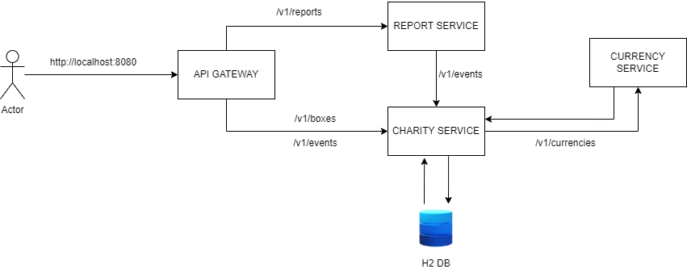
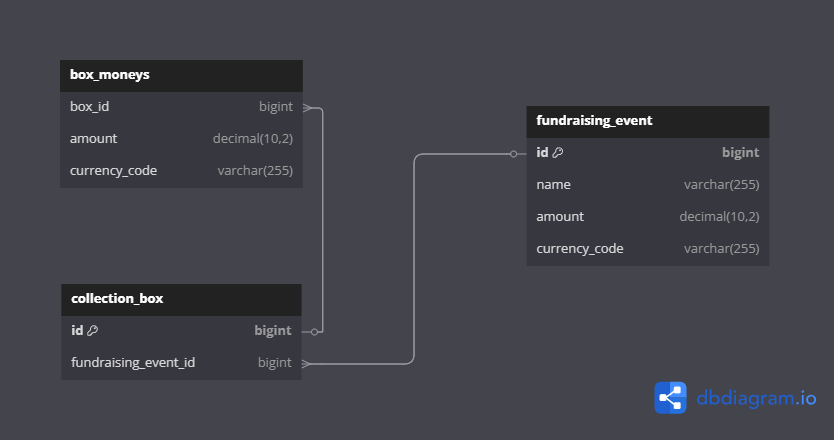

# RESTful API for Charity Fundraising
This project is a RESTful API for managing charity fundraising events, collection boxes, and generating reports. 
It is built using Spring Boot and follows a microservices architecture.

## 🚀 Running the Application

Follow the steps below to start all microservices locally (without Docker).

### 1. Clone the repository

```bash
git clone https://github.com/Filip7243/charity-api
cd charity-api
```

### 2. Build all modules

```bash
./mvnw clean install
```

### 3. Start the microservices (in this order)

Tip: 💡 Open a new terminal for each service.

#### 3.1 Discovery Server (Eureka)

```bash
cd discovery-server
../mvnw spring-boot:run
```

#### 3.2 Gateway

```bash
cd api-gateway
../mvnw spring-boot:run
```

#### 3.3 Charity Service

```bash
cd charity-service
../mvnw spring-boot:run
```

#### 3.4 Report Service

```bash
cd report-service
../mvnw spring-boot:run
```

#### 3.5 Currency Service

```bash
cd currency-service
../mvnw spring-boot:run
```

### 4. Open H2 console

- Check charity-service port (should be in the console after starting the service)
- Open your browser and go to: http://localhost:<CHARITY_SERVICE_PORT>/h2-console
- Login with the following credentials:
    - **JDBC URL**: `jdbc:h2:mem:charity_db`
    - **User Name**: `admin`
    - **Password**: `admin`

## 🐳 Running the Application with Docker

You can also run the entire microservices architecture using **Docker Compose**.

### 1. Build and start all containers

In the root directory of the project (charity-api), run:

```bash
./mvnw clean package
```

Make sure Docker and Docker Compose are installed. Then, from the project root:

```bash
docker-compose up --build
```

🕒 Important: After all services start, wait a few seconds for them to register with the Eureka server. The system might
take a short moment to stabilize.

### 2. Access the services

- **API Gateway**: http://localhost:8080/
- **Eureka Server**: http://localhost:8761/
- **Eureka Server Health**: http://localhost:8761/actuator/health

### ⚠️ H2 Console Note

When running with Docker:

- H2 Console is not available in the browser.
- The in-memory H2 databases exist only inside each container and are not accessible externally.

If you need database access for testing or debugging, consider running the services manually without Docker.

### 📦 Stopping the containers

```
docker-compose down
```

## 📘 API Endpoints

All endpoints below are exposed by the **Charity Service** and are available through the API Gateway (
`http://localhost:8080/`).

### 🔹 Create a new fundraising event

**POST** `/v1/events`

Create a new fundraising event with name and currency code.

**Request Body:**

```json
{
  "name": "Help Children in Need",
  "code": "USD"
}
```

### 🔹 Get all fundraising events

**GET** `/v1/events`
**Response Body:**

```json
[
  {
    "name": "Support School Supplies",
    "numOfBoxes": 15,
    "amount": 1200.50,
    "currencyCode": "PLN"
  },
  {
    "name": "Medical Aid Campaign",
    "numOfBoxes": 25,
    "amount": 3000.00,
    "currencyCode": "USD"
  }
]
```

### 🔹 Create a new collection box

**POST** `/v1/boxes`

**Request Body:**

```json
{
  "currencyCodes": [
    "PLN",
    "USD"
  ],
  "fundraisingEventId": 1
}
```

### 🔹 Get all collection boxes

**GET** `/v1/boxes`

**Response Body:**

```json
[
  {
    "boxId": 1,
    "isAssigned": false,
    "isEmpty": true,
    "currencyCodes": [
      "PLN",
      "USD"
    ]
  },
  {
    "boxId": 2,
    "isAssigned": true,
    "isEmpty": false,
    "currencyCodes": [
      "EUR"
    ]
  }
]
```

### 🔹 Get a collection box by ID

**GET** `/v1/boxes/{boxId}`

**Response Body:**

```json
{
  "boxId": 1,
  "isAssigned": false,
  "isEmpty": true,
  "currencyCodes": [
    "PLN",
    "USD"
  ]
}
```

### 🔹 Delete a collection box

**DELETE** `/v1/boxes/{boxId}`

**Response: 204 No Content**

### 🔹 Assign a collection box to a fundraising event

**PATCH** `/v1/boxes/assign/{boxId}/events/{eventId}`

**Response Body:**

```json
{
  "boxId": 2,
  "isAssigned": true,
  "isEmpty": true,
  "currencyCodes": [
    "PLN"
  ]
}
```

### 🔹 Add money to a box

**PATCH** `/v1/boxes/add-money`

**Request Body:**

```json
{
  "boxId": 2,
  "amount": 150.75,
  "code": "PLN"
}
```

**Response: 204 No Content**

### 🔹 Transfer money from a box to a fundraising event

**PATCH** `/v1/boxes/{boxId}/transfer/{eventId}`

**Reponse Body:**

```json
{
  "boxId": 2,
  "isAssigned": true,
  "isEmpty": true,
  "currencyCodes": [
    "PLN"
  ]
}
```

Bellow endpoint is exposed by the **Report Service** and available through the API Gateway (http://localhost:8080/):

### 🔹 Generate a fundraising report (PDF)

**GET** `/v1/reports/pdf`

Generates a PDF report summarizing the current fundraising data and returns it as a downloadable file.

**Response:**

- **Status:** `200 OK`
- **Headers:**
  - `Content-Type: application/pdf`
  - `Content-Disposition: attachment; filename="report.pdf"`
- **Body:** Binary content of the generated PDF

**Usage example (with `curl`):**

```bash
curl -X GET http://localhost:8080/v1/reports/pdf -o report.pdf
```
You can also test the endpoint using Postman or any other API testing tool.
In the ```./postman``` directory, you can find a collection with all endpoints in JSON format,
import and have fun :)

## 🚀 Architecture
This application is based on a microservices architecture, where each domain-specific functionality is implemented as a separate service.

### Key Components:
- **API GATEWAY**: Acts as a single entry point for all client requests. It listens on port 8080 and routes the requests to the appropriate microservice.
- **Eureka Discovery Server**: All microservices register themselves with Eureka, which serves as a service registry. This enables dynamic discovery of services without hardcoding their locations.
- **Load Balancing**: Services communicate with each other using REST over HTTP, leveraging load-balanced URIs (lb://service-name) through Spring Cloud LoadBalancer.



## 🗃️ Database Design
The application uses a relational database schema with the following key entities:
- ```CollectionBox```: Represents a physical collection box used during fundraising events. It holds a list of Money entries and is linked to a single FundraisingEvent.

- ```FundraisingEvent```: Represents an event during which funds are collected. It stores the name of the event and the total amount collected (as a Money value).

- ```Money```: An embeddable value object that represents a monetary amount and its currency code. It is used both inside the CollectionBox (as a collection of embedded values) and in FundraisingEvent (as a single embedded value).

